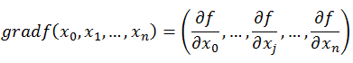

### 梯度下降（gradient descent）
梯度下降在机器学习中应用十分广泛，它主要做的一件事情就是通过**迭代**找到目标函数的最小值，或者收敛到最小值。

**梯度的定义：**
<div align="center">
  
</div>

在实际的运用过程中，我们通过不断迭代来计算目标函数的全局最小值，比如通过梯度下降求目
标函数 $f = x_1^2 + x_2^2 + 2x_3^2$ 的最小值，当然通过我们肉眼观察，可以发现最小值在(0,0,0)处取得，现在我们使用梯度下降进行演示
1.函数的梯度：$\nabla J$ = <$2x_1 , 2x_2, 4x_3$>
2.梯度下降的迭代公式：$
\Theta^{(1)} = \Theta^{(0)} + \alpha \nabla J(\Theta) \;\Big|_{\Theta = \Theta^{(0)}}
$ （α是学习率）
这里我们使用python语言来模拟这个迭代过程,假设我们从起始点(1,1,1)开始，学习率设置为0.4,这里我们迭代100次，因为我们知道函数的最小值是，所以我们记录每次迭代过后的函数值

```python
import numpy as np


# 函数
def f(point: np.array) -> float:
    weights = np.array([1, 1, 2])  # 对应 [a1^2, a2^2, 2*a3^2]
    result = np.sum(weights * (point**2))
    return result


# 梯度
def gradient(point: np.array) -> np.array:
    factor = np.array([2, 2, 4])
    return point * factor


start = np.array([1, 1, 1])
α = 0.4

print(f"{'迭代':^6} | {'x值':^30} | {'函数值':^12}")
print("-" * 55)

for i in range(50):
    tmp = start - α * gradient(start)
    fvalue = f(tmp)
    # 科学计数法，3位有效数字
    tmp_str = np.array2string(tmp, formatter={"float_kind": lambda x: f"{x:.3e}"})
    print(f"{i:^6} | {tmp_str:^30} | {fvalue:^12.3e}")
    start = tmp
```
>
>   迭代   |               x值               |     函数值     
-------------------------------------------------------
  0    | [2.000e-01 2.000e-01 -6.000e-01] |  8.000e-01
  1    | [4.000e-02 4.000e-02 3.600e-01] |  2.624e-01
  2    | [8.000e-03 8.000e-03 -2.160e-01] |  9.344e-02
  3    | [1.600e-03 1.600e-03 1.296e-01] |  3.360e-02
  4    | [3.200e-04 3.200e-04 -7.776e-02] |  1.209e-02
  5    | [6.400e-05 6.400e-05 4.666e-02] |  4.354e-03
  6    | [1.280e-05 1.280e-05 -2.799e-02] |  1.567e-03
  7    | [2.560e-06 2.560e-06 1.680e-02] |  5.642e-04
  8    | [5.120e-07 5.120e-07 -1.008e-02] |  2.031e-04
  9    | [1.024e-07 1.024e-07 6.047e-03] |  7.312e-05
  10   | [2.048e-08 2.048e-08 -3.628e-03] |  2.632e-05
  11   | [4.096e-09 4.096e-09 2.177e-03] |  9.477e-06
  12   | [8.192e-10 8.192e-10 -1.306e-03] |  3.412e-06
  13   | [1.638e-10 1.638e-10 7.836e-04] |  1.228e-06
  14   | [3.277e-11 3.277e-11 -4.702e-04] |  4.421e-07
  15   | [6.554e-12 6.554e-12 2.821e-04] |  1.592e-07
  16   | [1.311e-12 1.311e-12 -1.693e-04] |  5.730e-08
  17   | [2.621e-13 2.621e-13 1.016e-04] |  2.063e-08
  18   | [5.243e-14 5.243e-14 -6.094e-05] |  7.426e-09
  19   | [1.049e-14 1.049e-14 3.656e-05] |  2.673e-09
  20   | [2.097e-15 2.097e-15 -2.194e-05] |  9.625e-10
  21   | [4.194e-16 4.194e-16 1.316e-05] |  3.465e-10
  22   | [8.389e-17 8.389e-17 -7.897e-06] |  1.247e-10
  23   | [1.678e-17 1.678e-17 4.738e-06] |  4.490e-11
  24   | [3.355e-18 3.355e-18 -2.843e-06] |  1.617e-11
  25   | [6.711e-19 6.711e-19 1.706e-06] |  5.820e-12
  26   | [1.342e-19 1.342e-19 -1.023e-06] |  2.095e-12
  27   | [2.684e-20 2.684e-20 6.141e-07] |  7.542e-13
  28   | [5.369e-21 5.369e-21 -3.685e-07] |  2.715e-13
  29   | [1.074e-21 1.074e-21 2.211e-07] |  9.775e-14
  30   | [2.147e-22 2.147e-22 -1.326e-07] |  3.519e-14
  31   | [4.295e-23 4.295e-23 7.959e-08] |  1.267e-14
  32   | [8.590e-24 8.590e-24 -4.775e-08] |  4.561e-15
  33   | [1.718e-24 1.718e-24 2.865e-08] |  1.642e-15
  34   | [3.436e-25 3.436e-25 -1.719e-08] |  5.910e-16
  35   | [6.872e-26 6.872e-26 1.031e-08] |  2.128e-16
  36   | [1.374e-26 1.374e-26 -6.189e-09] |  7.660e-17
  37   | [2.749e-27 2.749e-27 3.713e-09] |  2.758e-17
  38   | [5.498e-28 5.498e-28 -2.228e-09] |  9.927e-18
  39   | [1.100e-28 1.100e-28 1.337e-09] |  3.574e-18
  40   | [2.199e-29 2.199e-29 -8.020e-10] |  1.287e-18
  41   | [4.398e-30 4.398e-30 4.812e-10] |  4.632e-19
  42   | [8.796e-31 8.796e-31 -2.887e-10] |  1.667e-19
  43   | [1.759e-31 1.759e-31 1.732e-10] |  6.003e-20
  44   | [3.518e-32 3.518e-32 -1.039e-10] |  2.161e-20
  45   | [7.037e-33 7.037e-33 6.237e-11] |  7.779e-21
  46   | [1.407e-33 1.407e-33 -3.742e-11] |  2.801e-21
  47   | [2.815e-34 2.815e-34 2.245e-11] |  1.008e-21
  48   | [5.629e-35 5.629e-35 -1.347e-11] |  3.630e-22
  49   | [1.126e-35 1.126e-35 8.083e-12] |  1.307e-22

---
可以看到不断进行迭代，函数值越来越逼近最小值0，x也越来越逼近(0,0,0)

**在梯度下降的算法中，我们认为梯度的方向就是函数上升最快的方向，为什么？**


#### 具体证明：梯度方向是函数上升最快的方向


**1. 方向导数的定义**  
设函数 \( f: \mathbb{R}^n \to \mathbb{R} \) 在点 \(\mathbf{x}_0\) 的邻域内有定义，\(\mathbf{u} = (u_1, u_2, \dots, u_n)\) 是单位向量（\(\|\mathbf{u}\| = 1\)）。则 \(f\) 在 \(\mathbf{x}_0\) 沿方向 \(\mathbf{u}\) 的**方向导数**定义为：
\[
\frac{\partial f}{\partial \mathbf{u}}(\mathbf{x}_0) = \lim_{h \to 0} \frac{f(\mathbf{x}_0 + h \mathbf{u}) - f(\mathbf{x}_0)}{h}
\]
它表示函数沿方向 \(\mathbf{u}\) 的瞬时变化率。

**2. 梯度的定义**  
若 \(f\) 在 \(\mathbf{x}_0\) 的所有偏导数存在，则**梯度** \(\nabla f(\mathbf{x}_0)\) 是一个向量：
\[
\nabla f(\mathbf{x}_0) = \left( \frac{\partial f}{\partial x_1}, \frac{\partial f}{\partial x_2}, \dots, \frac{\partial f}{\partial x_n} \right) \bigg|_{\mathbf{x}=\mathbf{x}_0}
\]

---

#### 方向导数与梯度的关系（关键定理）
**定理**：若 \(f\) 在 \(\mathbf{x}_0\) **可微**，则对任意单位向量 \(\mathbf{u}\)，有：
\[
\frac{\partial f}{\partial \mathbf{u}}(\mathbf{x}_0) = \nabla f(\mathbf{x}_0) \cdot \mathbf{u}
\]

**证明**：  
由可微性定义，函数增量可表示为：
\[
f(\mathbf{x}_0 + \mathbf{h}) - f(\mathbf{x}_0) = \nabla f(\mathbf{x}_0) \cdot \mathbf{h} + \|\mathbf{h}\| \cdot \alpha(\mathbf{h})
\]
其中 \(\alpha(\mathbf{h}) \to 0\) 当 \(\|\mathbf{h}\| \to 0\)。  
令 \(\mathbf{h} = h \mathbf{u}\)（\(h\) 为标量），代入得：
\[
f(\mathbf{x}_0 + h \mathbf{u}) - f(\mathbf{x}_0) = \nabla f(\mathbf{x}_0) \cdot (h \mathbf{u}) + \|h \mathbf{u}\| \cdot \alpha(h \mathbf{u}) = h \cdot \nabla f(\mathbf{x}_0) \cdot \mathbf{u} + |h| \cdot \alpha(h \mathbf{u})
\]
代入方向导数定义：
\[
\frac{\partial f}{\partial \mathbf{u}}(\mathbf{x}_0) = \lim_{h \to 0} \frac{h \cdot \nabla f(\mathbf{x}_0) \cdot \mathbf{u} + |h| \cdot \alpha(h \mathbf{u})}{h}
\]
- 当 \(h > 0\) 时，\(|h| = h\)，得：
  \[
  \lim_{h \to 0^+} \left( \nabla f(\mathbf{x}_0) \cdot \mathbf{u} + \alpha(h \mathbf{u}) \right) = \nabla f(\mathbf{x}_0) \cdot \mathbf{u}
  \]
- 当 \(h < 0\) 时，\(|h| = -h\)，得：
  \[
  \lim_{h \to 0^-} \left( \nabla f(\mathbf{x}_0) \cdot \mathbf{u} - \alpha(h \mathbf{u}) \right) = \nabla f(\mathbf{x}_0) \cdot \mathbf{u}
  \]
综上，\(\frac{\partial f}{\partial \mathbf{u}}(\mathbf{x}_0) = \nabla f(\mathbf{x}_0) \cdot \mathbf{u}\).

---

#### 步骤3：证明梯度方向使方向导数最大化
由定理 \(\frac{\partial f}{\partial \mathbf{u}} = \nabla f \cdot \mathbf{u}\)，结合点积公式：
\[
\nabla f \cdot \mathbf{u} = \|\nabla f\| \cdot \|\mathbf{u}\| \cdot \cos \theta = \|\nabla f\| \cdot \cos \theta
\]
其中 \(\theta\) 是梯度 \(\nabla f\) 与方向 \(\mathbf{u}\) 的夹角。  
- \(\|\nabla f\|\) 是固定值（非负），  
- \(\cos \theta\) 的最大值为 \(1\)（当 \(\theta = 0^\circ\) 时），  
- 此时 \(\mathbf{u}\) 与 \(\nabla f\) 同向，且方向导数为 \(\|\nabla f\|\)。  

**结论**：  
梯度方向 \(\mathbf{u} = \frac{\nabla f}{\|\nabla f\|}\) 使方向导数最大化，即函数上升最快。

---

#### 补充说明
- **下降最快方向**：当 \(\theta = 180^\circ\)（\(\cos \theta = -1\)），即 \(\mathbf{u} = -\frac{\nabla f}{\|\nabla f\|}\) 时，方向导数为 \(-\|\nabla f\|\)，函数下降最快。
- **几何直观**：梯度是函数等值面的法向量，指向函数值增长最陡峭的方向。

> **总结**：通过可微性假设和方向导数与梯度的关系 \(\frac{\partial f}{\partial \mathbf{u}} = \nabla f \cdot \mathbf{u}\)，结合向量点积的极值性质，严格证明了梯度方向是函数上升最快的方向。