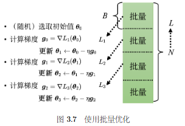

**背景**：
    在进行梯度下降的时候，并不是对所有的数据的损失L来计算梯度，而是把数据分成一个一个的批量（batch），每次在更新参数的时候，用一个批次的数据来计算损失和梯度，遍历所有batch的过程称为一个回合（epoch），并且在不同epoch中，把数据进行分batch的时候，还会进行随机打乱（shuffle），也就是在每一个epoch开始之前重新划分batch
    原理如图

**批量大小对于梯度下降方法的影响：**
- 批量梯度下降发(Batch Gradient Descent, BGD)：使用整个训练集的所有样本来 计算损失函数的梯度。
  - 优点：
    - 于每一步都基于全部数据，其梯度方向非常准确，能直接指向全局最优的方向（对于凸函数而言）。下降过程非常平滑。
  - 缺点：
    - 速度很慢，每次更新都要遍历所有数据，计算开销巨大，而且每次要将所有数据读取进显存，几乎是不可能的
    - 容易陷入局部最小值，BGD会因为巨大的惯性而陷入局部最小值，惯性来源于它每一步更新都使用全部数据计算出的“平均梯度”，因为每次都是计算的确定的方向，所以当陷入局部最小值的时候，梯度为0
- 随机梯度下降法（Stochastic Gradient Descent,SGD）:在每一次参数更新时，它只随机抽取一个训练样本来计算梯度。
  - 优点
    - 速度快，但波动大
    - 内存需求低
    - 能够跳出局部最小值，因为每次只有一个batch，这单一样本的梯度不能代表整个数据，它可能指向任何方向，这样的方法相当于给真实梯度引入了一个*噪声*，想象一个坑（局部最优点）。在坑底，对于所有数据点的平均梯度确实是零。但是，对于任何一个单独的、特定的数据点来说，它在坑底这个位置的梯度几乎肯定不是零！
  - 缺点
    - 波动很大：由于单个样本可能不代表整个数据集的特性，梯度方向震荡非常剧烈。下降路径曲折蜿蜒。
    - 永不收敛：由于噪声的存在，它通常只能在最小值附近徘徊，而很难稳定地到达最小值点。

- 折中方案-小批量梯度下降法（Mini-Batch Gradient Descent, MBGD）：在每一次参数更新时，它使用一小撮（一个Mini-Batch）数据（例如32, 64, 128个样本）来计算梯度。

**动量法**
动量法（momentum method）是另外一个可以对抗鞍点或局部最小值点的方法。假设误差表面就是真正的斜坡，参数是一个球，把球从斜坡上滚下来，如果使用梯度下降，球走到或鞍点就停住了。 但是在物理的世界里，一个球如果从高处滚下来，就算滚到鞍点或局部最小值点，因为惯性的关系它还是会继续往前走。如果球的动量足够大，其甚至翻过
小坡继续往前走。 因此在物理的世界里面，一个球从高处滚下来的时候，它并不一定会被鞍点或局部最小值点卡住，如果将其应用到*梯度下降中，这就是动量*。

在之前的梯度下降中，初始的参数为θ0,计算完梯度之后，是沿着梯度的反方向去更新参数。动量法（Momentum）是一种梯度下降优化算法的增强技术，它模拟了物理学中动量的概念，通过**积累之前的梯度信息来加速收敛并减少优化过程中的震荡。**
计算当前梯度：$g_t = \nabla J(\theta_t)$

更新速度：$v_t = \gamma v_{t-1} + \eta g_t$

更新参数：$\theta_{t+1} = \theta_t - v_t$